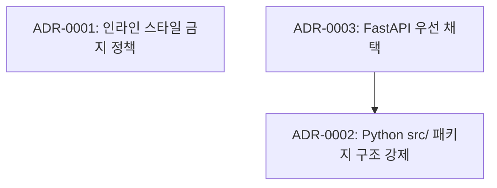

# ADR 관계도

> ADR 간의 관계를 시각화합니다.

```mermaid
graph TD
    ADR0002[ADR-0002: Python src/ 패키지 구조 강제]
    ADR0001[ADR-0001: 인라인 스타일 금지 정책]
    ADR0003[ADR-0003: FastAPI 우선 채택]
    ADR0003 --> ADR0002

    classDef accepted fill:#10b981,color:white
    classDef deprecated fill:#ef4444,color:white
    classDef proposed fill:#f59e0b,color:white
```

## 범례

- 실선 화살표: 관련 ADR
- 점선 화살표: 대체 관계